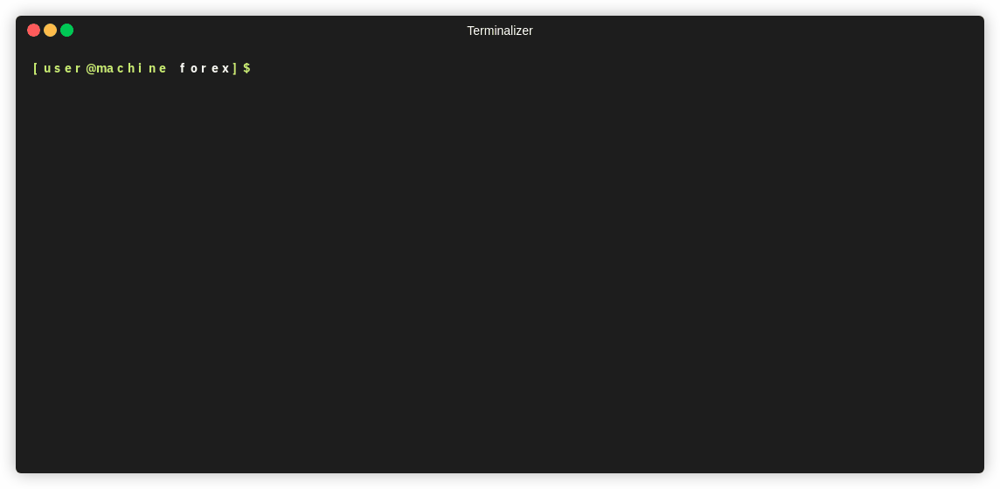

# Forex
Converting currencies in your terminal



## Installation
- Build from source

``` sh
$ make build
```
make sure you've rust (1.43 nightly) installed on your system.

- crates.io

``` sh
$ cargo install forex
```

## Usage

``` sh
USAGE:
    forex [FLAGS] [OPTIONS] <amount> [ARGS]

FLAGS:
        --no-cache    bypass cache
    -h, --help        Prints help information
    -V, --version     Prints version information

OPTIONS:
    -p, --precision <precision>    set a custom currency precision [default: 2]

ARGS:
    <amount>       floating number of cash to convert
    <base>         base currency of conversion [default: IDR]
    <target>...    target currency of conversion [default: USD]
    
EXAMPLE:
    $ forex 12000 IDR USD
    $ forex 12000 IDR USD GBP # multiple target currency
    $ forex -p 5 12000 IDR USD # set precision point to 5
    $ forex --no-cache 12000 IDR USD # skip using cache and straight up call the API
```

## API
- [exchangeratesapi](https://exchangeratesapi.io/)

## License
[MIT](https://opensource.org/licenses/MIT)
